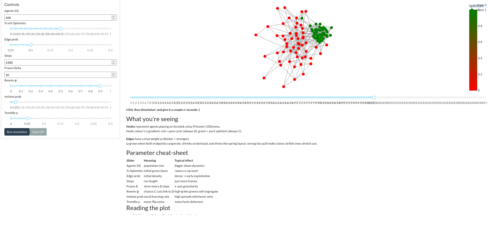
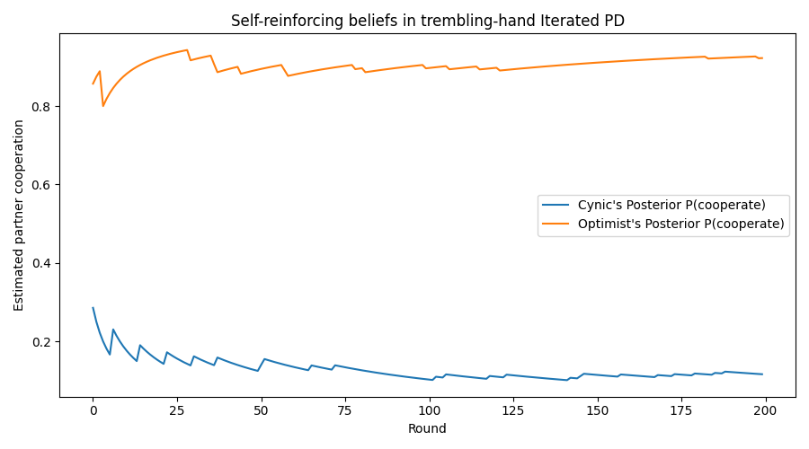
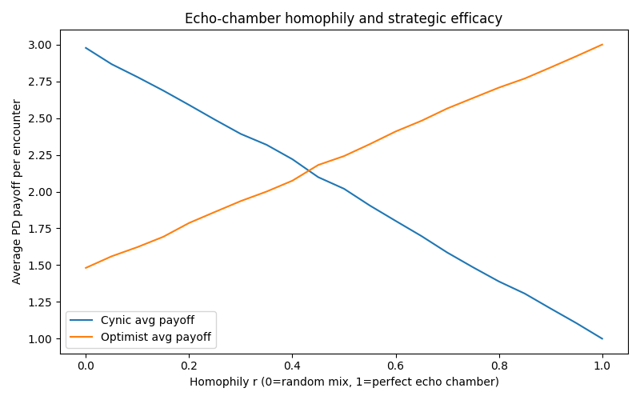
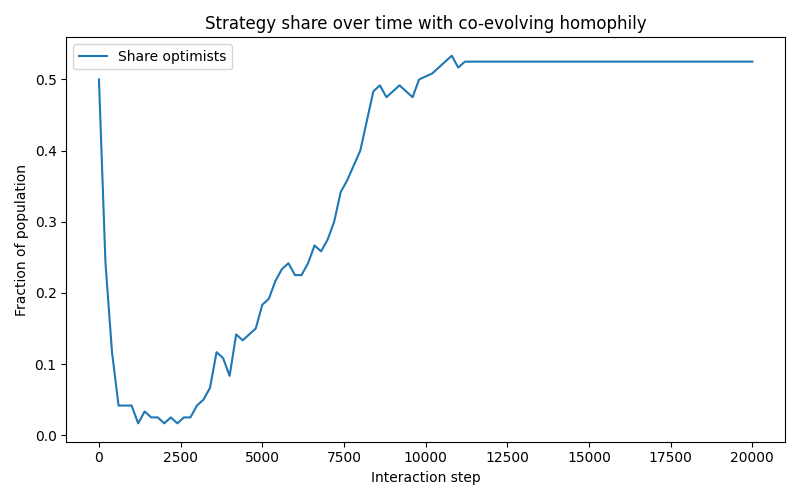
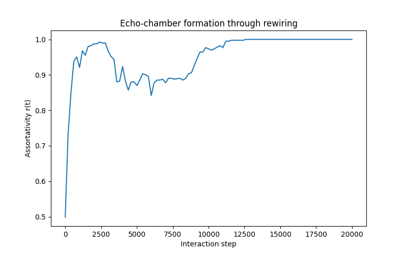
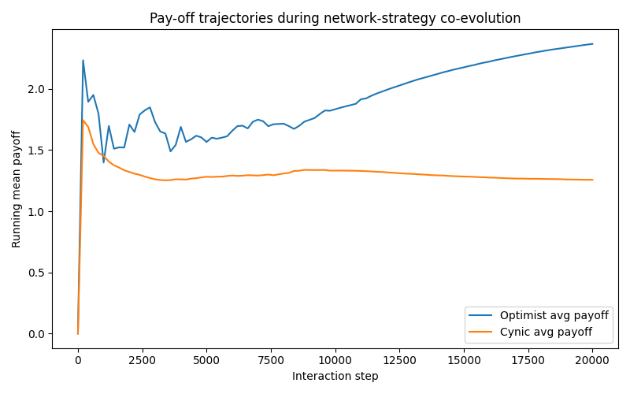
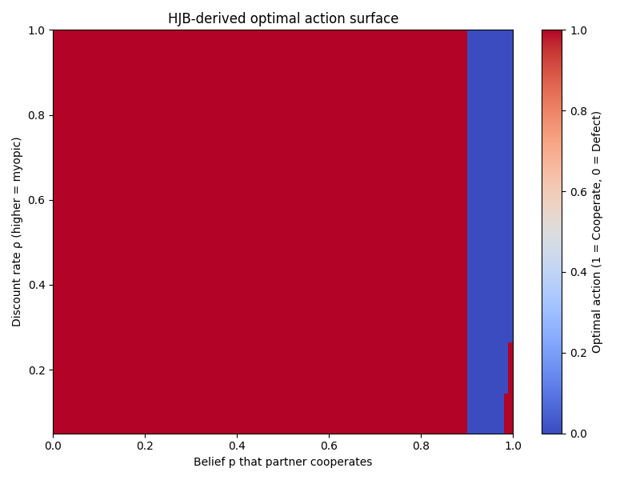
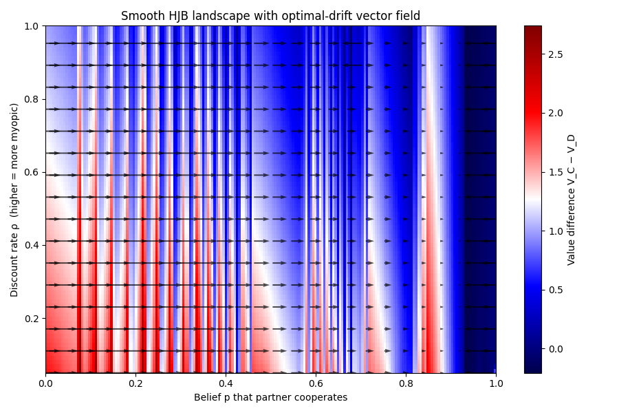

# Cynicism Game Theory (Iterated Prisoner's Dilemma)

Modelling Dynamics of Cynicism using a simple trembling hand iterated Prisoner's Dilemma.

Visit the app at [https://pd-echo.fly.dev/](https://pd-echo.fly.dev/) to get something like:

Math to come (see code for now). 

## More pretty pictures

