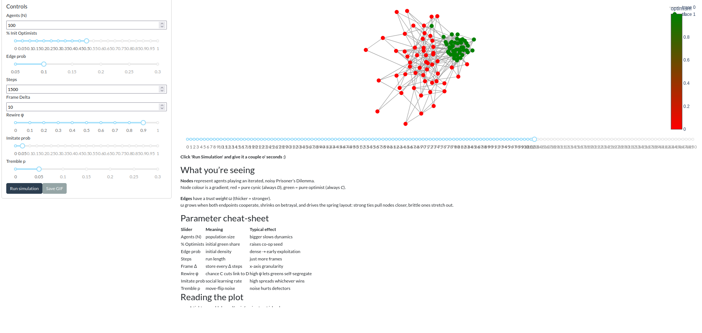
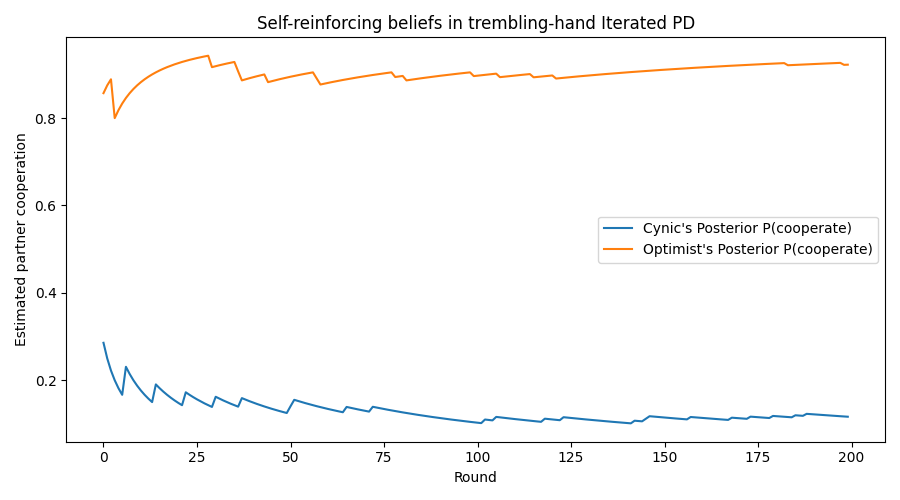
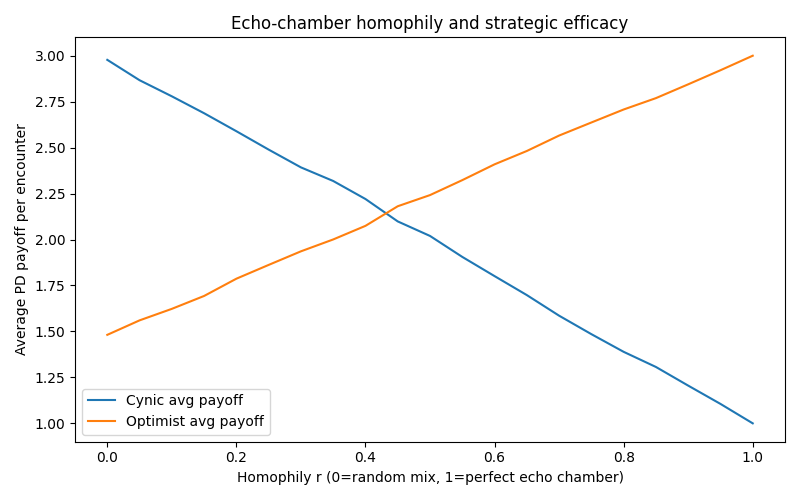
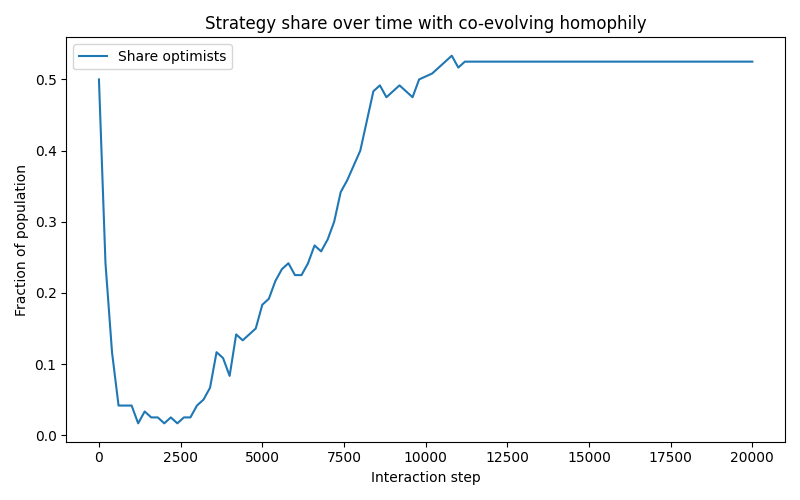
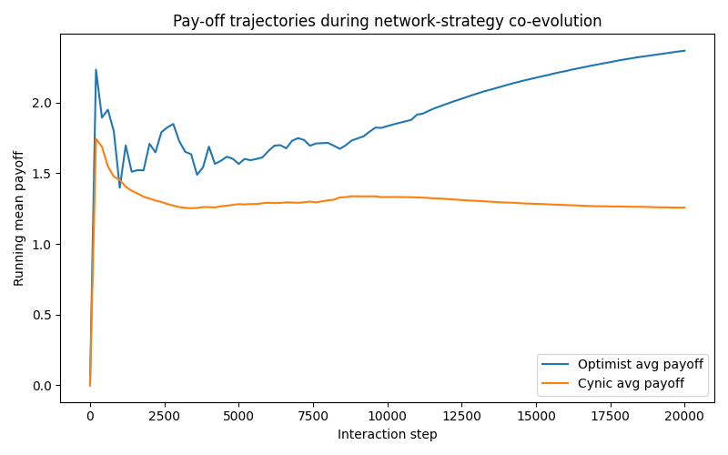
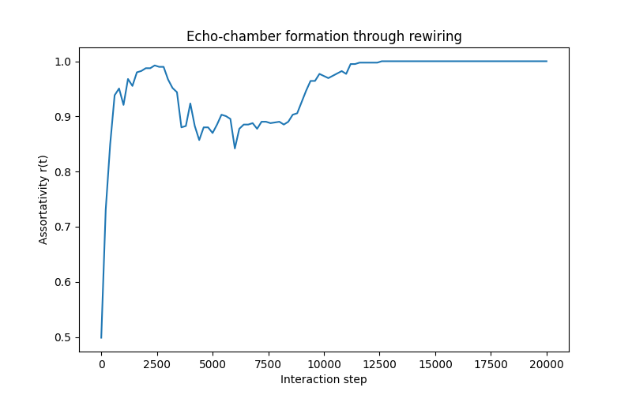
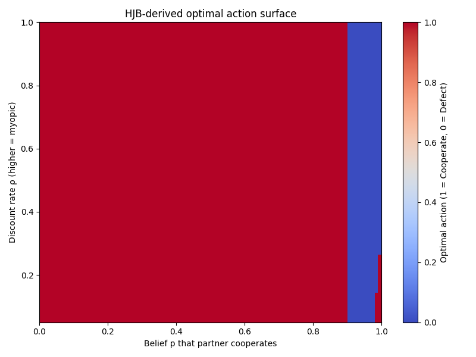
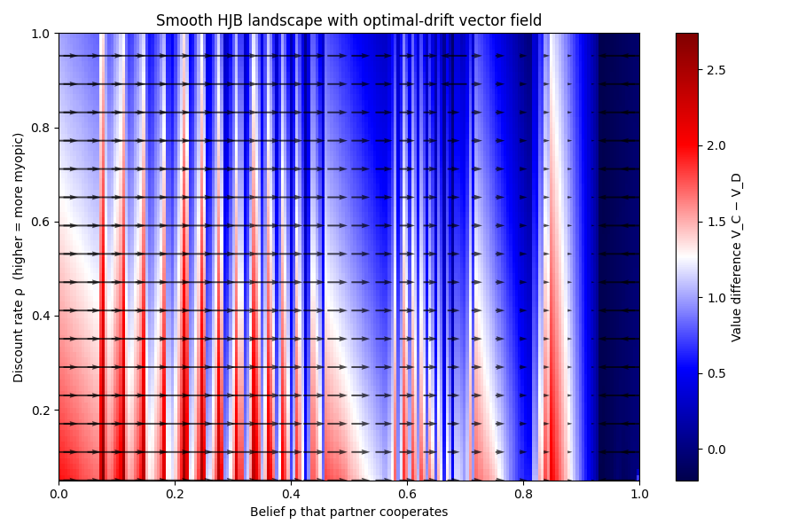

# Cynicism Game Theory (Iterated Prisoner's Dilemma)

Modelling the dynamics of cynicism on a co-evolving social graph using a
trembling-hand iterated Prisoner's Dilemma with Bayesian beliefs, weighted
trust ties, and homophilous rewiring.

Live demo: [https://pd-echo.fly.dev/](https://pd-echo.fly.dev/)



## The simulation in [network.py](network.py)

`N` agents sit on a node of an Erdős–Rényi graph `G_0 = (V, E_0)` with
edge probability `p_edge`. The graph is forced to be connected, every edge
gets an initial trust weight `ω_ij = 1`, and a force-directed layout is
computed with `ω` as the spring constant.

Each agent `i` carries a Beta prior over the probability that a random
partner *defects*:

- prior cooperation count `α_i`
- prior defection count `β_i`
- belief `p_i = E[p(defect)] = β_i / (α_i + β_i)`

Initialisation: a fraction `pct_opt` is drawn as optimists with
`(α, β) = (5, 1)` (so `p_i ≈ 0.17`); the rest start as `(2, 2)` (so `p_i = 0.5`).

### One interaction step

At every step the simulator:

1. Picks a random agent `i` and a uniformly random neighbour `j`.
2. Draws stochastic actions from each agent's own belief
   `a_i ~ Bernoulli(p_i)` mapped `1 → D, 0 → C`, then flips each action
   independently with the tremble probability `p_flip`.
3. Pays out the canonical PD matrix with `T > R > P > S` (defaults
   `R=3, S=0, T=5, P=1`):

   |       | C       | D       |
   |-------|---------|---------|
   | **C** | (R, R)  | (S, T)  |
   | **D** | (T, S)  | (P, P)  |

4. **Bayesian belief update.** Each agent updates its prior with the action
   it just observed from the partner:

   ```
   if a_j == C:  α_i ← α_i + 1   else:  β_i ← β_i + 1
   p_i ← β_i / (α_i + β_i)
   ```

   and symmetrically for `j`. With trembling hands, even a "true" cooperator
   occasionally produces a `D` observation, so beliefs only converge in
   probability.

5. **Trust weight update** on the edge `(i, j)`:

   ```
   ω_ij ← min(ω_ij + 0.3,  3.0)   if  a_i = a_j = C
   ω_ij ← max(ω_ij − 0.2,  0.1)   if  a_i = a_j = D
   ω_ij ← max(ω_ij − 0.4,  0.1)   otherwise
   ```

   These weights drive the spring layout: cooperative dyads pull together,
   exploited dyads stretch apart.

6. **Reputation EMA.** Each agent keeps an exponential moving average of its
   own payoffs, `rep_i ← (1 − α_rep) rep_i + α_rep π_i`.

7. **Popularity-weighted imitation.** With probability `imitate_prob`, agent
   `i`'s belief is overwritten by `j`'s (or vice versa) with probability
   proportional to `score = deg · avg_payoff`:

   ```
   score_i = deg(i) · π̄_i,   score_j = deg(j) · π̄_j
   P(i copies j) = score_j / (score_i + score_j)
   ```

   This couples social learning to network centrality — well-connected
   high earners are more likely to be copied.

8. **Homophilous rewiring.** If `i` cooperated while `j` defected, with
   probability `φ` the edge `(i, j)` is cut and `i` reconnects to a random
   agent on the *same belief side* (`p < 0.5` vs `p ≥ 0.5`) that it is not
   already linked to.

The replicator-style social dynamic informally summarised as

```
Δs_i ≈ λ · [π_j − π_i]_+ · (s_j − s_i)
```

is what step 7 implements (in popularity-weighted form), while step 8
co-evolves the topology.

## Parameters

| Symbol / slider     | Meaning                                            |
|---------------------|----------------------------------------------------|
| `N`                 | number of agents                                   |
| `pct_opt`           | initial share starting with optimist prior         |
| `p_edge`            | initial Erdős–Rényi density                        |
| `steps`             | number of pair encounters                          |
| `frame_delta`       | snapshot every Δ steps                             |
| `φ` (`rew_phi`)     | rewiring probability for an exploited cooperator   |
| `λ` (`imitate_prob`)| social-learning rate                               |
| `p_flip` (`tremble_p`)| per-action execution noise                       |
| `α_rep`             | EMA coefficient for the reputation channel         |
| `R, S, T, P`        | PD payoffs (`T > R > P > S`)                       |

## Companion plots

### [img/simple.png](img/simple.png) — self-reinforcing beliefs against Tit-for-Tat


Generated by [simple.py](simple.py). One agent plays 200 rounds against a
Tit-for-Tat partner with tremble `p_flip = 0.05`. Two seeds are compared:

- **Cynic** starts with `Beta(1, 5)` (expects little cooperation) and
  *intends* to defect every round.
- **Optimist** starts with `Beta(5, 1)` and intends to cooperate.

The y-axis is the running posterior mean `a / (a + b)` — the agent's
estimate of `P(partner cooperates)`. The cynic's defections trigger
Tit-for-Tat retaliation, so the cynic almost only ever observes `D` and its
estimate stays near zero; the optimist's cooperation begets cooperation and
its estimate stays near one. The gap is a textbook *self-fulfilling
prophecy*: identical mechanics, opposite stable beliefs.

### [img/assort.png](img/assort.png) — pure homophily sweep


Generated by [assort.py](assort.py). 50 always-defectors and 50
always-cooperators interact for 5 000 rounds. The homophily parameter
`r ∈ [0, 1]` is the probability that an agent picks a partner of its own
type (vs. uniformly at random). The plot sweeps `r` and reports each
strategy's average per-encounter payoff.

- At `r = 0` (well-mixed) cynics earn ~`T = 5` against the cooperators they
  encounter and cooperators are heavily exploited, so the cynic line sits
  far above the optimist line.
- As `r → 1` the populations segregate: cynics increasingly play
  `D` vs. `D` and converge to `P = 1`, while cooperators increasingly play
  `C` vs. `C` and converge to `R = 3`. The two curves cross — perfect echo
  chambers are *better* for cooperators than for defectors.

### [img/evo_strategies.png](img/evo_strategies.png) — strategy share over time


Generated by [evo.py](evo.py). 120 agents, payoff-based imitation
(`imitate_prob = 0.5`), homophilous rewiring (`φ = 0.8`), 20 000 steps,
sampled every 200. Plots the fraction of the population labelled "optimist"
through time. Whether it climbs to ~1 or collapses to ~0 depends on whether
rewiring lets the cooperators segregate fast enough to out-earn the
defectors before being copied away.

### [img/evo_payoffs.png](img/evo_payoffs.png) — payoff trajectories


Same run as above. Running mean payoff per type. Early on the cynics
exploit naïve cooperators and sit near `T`; once cooperators rewire into a
clique they push toward `R` while cynics, isolated with each other, sink
toward `P`. The crossover instant is where imitation typically tips the
population toward cooperation.

### [img/evo_assortativity.png](img/evo_assortativity.png) — echo-chamber formation


Same run. Network assortativity `r(t) = (same-type edges) / (total edges)`
over time. Starts near 0.5 (random graph with balanced types) and climbs
as `φ`-rewiring removes mixed edges. The slope is a direct readout of how
fast the network self-segregates into echo chambers.

### [img/optimal_action.png](img/optimal_action.png) — HJB best-response surface


Generated by [optimal.py](optimal.py). Solves a discounted infinite-horizon
Bellman equation for a single agent whose belief `p` that the partner
cooperates drifts deterministically toward whichever action it just played:

```
p_{t+1} = p_t + dt · k · (a_t − p_t),   a_t ∈ {0 = D, 1 = C}
V(p) = max_a { r(a, p) + e^{−ρ dt} V(p') }
r(C, p) = R p + S (1 − p)
r(D, p) = T p + P (1 − p)
```

Value iteration runs over a 101-point belief grid for 40 discount rates
`ρ`. The heatmap shows the resulting optimal action: red = cooperate,
blue = defect, with the y-axis the discount rate (high `ρ` = myopic) and
the x-axis the current belief. The boundary slopes upward: a patient agent
is willing to cooperate at much lower beliefs than a myopic one. *Cynicism
is myopia* — defection is only optimal in the upper-left, where the agent
discounts the future too steeply to invest in the cooperative basin.

### [img/coop_benefit.png](img/coop_benefit.png) — smooth value landscape and drift


Generated by [coop_benefit.py](coop_benefit.py). Same HJB problem on a
denser grid, but instead of plotting the binary policy it plots the
*continuous* value gap `V_C − V_D` (seismic colormap, red = cooperation
strictly better, blue = defection strictly better) and overlays the belief
drift field `dp/dt = k (a*(p, ρ) − p)` as horizontal arrows.

The arrows are bistable around the policy boundary: in the red region they
point right (cooperating drives `p` up toward 1, a stable cooperative
fixed point); in the blue region they point left (defecting drives `p`
down toward 0, a stable defection trap). The boundary is an unstable
saddle — small noise in belief decides which basin the agent falls into,
which is exactly the same mechanism that makes the network in
`network.py` settle into separated echo chambers.
